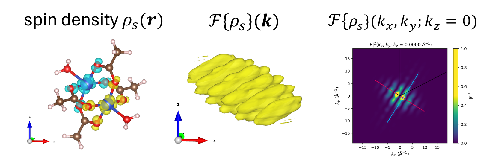

==========================
Examples
==========================

An example of use is given in ``./examples/fft_example.ipynb``. It uses input files from the `cube_files folder <https://github.com/liborsold/fft_electronic_spin_density/tree/master/cube_files>`_.

.. fft_electronic_spin_density example image

Import the ``Density`` class
-------------------------------------------------------------------

.. code-block:: python

    from fft_electronic_spin_density.utils import Density

Load the .cube file (spin) density
-------------------------------------------------------------------

.. code-block:: python

    density = Density(fname_cube_file='../cube_files/Cu2AC4_rho_sz_256.cube')

Visualize the density as 2D slices
-------------------------------------------------------------------

.. code-block:: python

    site_coordinates = density.get_sites_of_atoms(site_idx=[0])
    # z position of atom 0
    atom_0_z_coordinate = site_coordinates[0][2]

    # indices along the c lattice vector where density cuts should be plotted
    c_idx = density.get_c_idx_at_z_coordinates(z_coordinates=[0.0, atom_0_z_coordinate])

    density.plot_cube_rho_sz(c_idx_arr=c_idx, fout_name=f'rho_sz_exploded_masked.jpg', 
                                alpha=0.8, figsize=(6.0, 4.5), dpi=400, 
                                zeros_transparent=False, show_plot=True)

.. CrXY example image
.. image::
   ./_static/images/plot_2D_example_figure.png
   :width: 800px
   :align: center

Visualize the density in 3D
-------------------------------------------------------------------

.. code-block:: python

    # --- 3D plot ---

    # ---> show plot

Replace by a model
-------------------------------------------------------------------

.. code-block:: python

    # replace by model

*or even*: Fit model to the original density 
-------------------------------------------------------------------

.. code-block:: python

    # fit model

Integrate density to get the total charge (spin)
-------------------------------------------------------------------

.. code-block:: python

    rho_sz_tot, rho_sz_abs_tot = density.integrate_cube_file()

    # show the output
    

Perform FFT, plot and write out as a .cube file
-------------------------------------------------------------------

.. code-block:: python

    density.FFT()

    density.plot_fft_2D(i_kz=0)

    # ---> show plot

    # plot along cuts in the 2D map
    
    # ---> show plot

    # PLOT 3D
    # ---> show plot

    # WRITE OUT

    density.write_cube_file_fft(fout='fft_rho_sz.cube')

    # ----> show how it's visualized in VESTA

    

