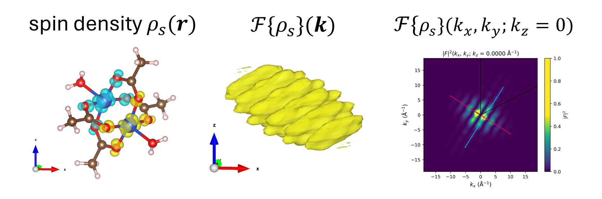

.. fft_electronic_spin_density documentation master file, created by
   sphinx-quickstart on Thu Mar 27 15:43:55 2025.
   You can adapt this file completely to your liking, but it should at least
   contain the root `toctree` directive.

Welcome to ``fft_electronic_spin_density``!
=================================================================

**fft_electronic_spin_density** is a Python package for performing FFT on Gaussian .cube files of charge or spin density, primarily to obtain the (magnetic) form factor for neutron scattering.

.. fft_electronic_spin_density example image

\ 

See the `project on GitHub <https://github.com/liborsold/fft_electronic_spin_density/tree/master>`_.

Quickstart
================

.. code-block:: python
   
   pip install fft_electronic_spin_density

then 

.. code-block:: python
   
   git clone https://github.com/liborsold/fft_electronic_spin_density.git
   
and execute the ``./examples/fft_examples.ipynb`` Jupyter notebook in the `examples folder <https://github.com/liborsold/fft_electronic_spin_density/tree/master/examples>`_.

Navigation
===============

.. toctree::
   :maxdepth: 1

   examples
   density_class
   api

Indices
==================

* :ref:`genindex`
* :ref:`modindex`
